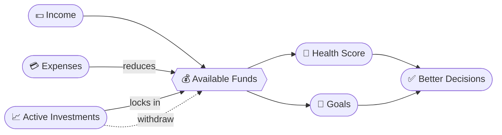

<div align="center">


<br>


</div>

<br>

```text
╔══════════════════════════════════════════════════════════╗
║                  F I N A N C I A L                       ║
║                  A S S I S T A N T                       ║
║ ──────────────────────────────────────────────────────── ║
║  RECEIPT #0001                         STATUS: ● ONLINE  ║
║ ──────────────────────────────────────────────────────── ║
║  1 x Expense Intelligence ........................ ✔     ║
║  1 x Fund Tracker ................................ ✔     ║
║  1 x Investment Center ........................... ✔     ║
║  1 x Goal Tracker ................................ ✔     ║
║  1 x Financial Health Score ...................... ✔     ║
║  1 x JWT-secured personal vault .................. ✔     ║
║ ──────────────────────────────────────────────────────── ║
║  TOTAL CLARITY ............................... PRICELESS ║
║ ──────────────────────────────────────────────────────── ║
║   *** THANK YOU FOR TAKING CONTROL OF YOUR MONEY ***     ║
╚══════════════════════════════════════════════════════════╝
```

> **Most finance apps show you a number. This one shows you a _decision_.**
> Expenses, income, investments and goals live in one connected ledger, so every change ripples through your whole financial picture.

<br>

## 📖 Index

| | | |
|---|---|---|
| [🧾 Ledger Entries](#-ledger-entries) | [🔄 The Money Loop](#-the-money-loop) | [🧮 Worked Example](#-worked-example) |
| [🚀 Boot Sequence](#-boot-sequence) | [🗂️ Anatomy](#️-anatomy) | [🛣️ Roadmap](#️-roadmap) |

<br>

## 🧾 Ledger Entries

Each module is a line item in your financial life. Open any one to see what's inside.

<details>
<summary><b>💳 &nbsp;ENTRY 01 — Expense Intelligence</b> &nbsp;·&nbsp; <i>where is it going?</i></summary>
<br>

- Add, edit and delete expenses
- Categorize every spend
- Monthly spending analysis with visual breakdowns
- Spot spending patterns
- Full expense history

</details>

<details>
<summary><b>💰 &nbsp;ENTRY 02 — Fund Tracker</b> &nbsp;·&nbsp; <i>how long will it last?</i></summary>
<br>

- Monthly income and current balance
- This month vs. previous month spending
- Daily spending average
- **Days your balance can last** (your runway)
- Emergency fund estimation

</details>

<details>
<summary><b>📈 &nbsp;ENTRY 03 — Investment Center</b> &nbsp;·&nbsp; <i>where is it growing?</i></summary>
<br>

- Add investments and track the invested amount
- Track current value and expected return rate
- Active investments and full history
- Withdrawal tracking, wired into your available funds

</details>

<details>
<summary><b>🎯 &nbsp;ENTRY 04 — Goal Tracker</b> &nbsp;·&nbsp; <i>what am I saving toward?</i></summary>
<br>

- Create goals with target amounts
- Track progress over time
- Organize priorities and future plans

</details>

<details>
<summary><b>🧠 &nbsp;ENTRY 05 — Financial Health Score</b> &nbsp;·&nbsp; <i>how am I doing overall?</i></summary>
<br>

A simplified, at-a-glance view of your financial position, built from the data already in your account.

</details>

<details>
<summary><b>🔐 &nbsp;ENTRY 06 — Personal Vault</b> &nbsp;·&nbsp; <i>is it private?</i></summary>
<br>

- JWT authentication
- Protected API routes
- User-specific records
- Password hashing
- Environment-based secrets

</details>

<br>

## 🔄 The Money Loop

Nothing here lives in a silo. Investing locks money away; withdrawing sets it free, and your Fund Tracker reacts instantly.



<br>

## 🧮 Worked Example

*Illustrative numbers, to show how the pieces connect:*

```text
  Monthly income ................ 50,000
  Spent this month .............. 18,000
  Put into investments .......... 10,000   ← locked, not "available"
  ─────────────────────────────────────────
  Available funds ............... 22,000

  Daily spending average ........    600
  Runway ........................  ~36 days

  ⟲ Withdraw 4,000 from an investment...
  Available funds ............... 26,000   ← instantly freed
  Runway ........................  ~43 days
```

<br>

## 🚀 Boot Sequence

<table>
<tr>
<td width="50%" valign="top">

### ⚙️ `01` Backend

```bash
git clone https://github.com/SuniyanJana/Financial-Assistant.git
cd Financial-Assistant/Backend
npm install
```

Create `Backend/.env` (use `.env.example` as a template):

```env
PORT=5000
NODE_ENV=development
MONGO_URI=your_mongodb_connection_string
JWT_SECRET=your_secret_key
JWT_EXPIRES_IN=7d
CLIENT_URL=http://localhost:5173
```

```bash
npm run dev
```

🟢 Runs at `http://localhost:5000`

</td>
<td width="50%" valign="top">

### 🎨 `02` Frontend

In a **new terminal**:

```bash
cd Frontend
npm install
```

Create `Frontend/.env`:

```env
VITE_API_URL=http://localhost:5000/api
```

```bash
npm run dev
```

🟢 Open `http://localhost:5173`

</td>
</tr>
</table>

<br>

## 🗂️ Anatomy

```text
Financial-Assistant/
├── Backend/
│   ├── src/
│   │   ├── config/        ⚙️  database & app config
│   │   ├── controllers/   🧠  business logic
│   │   ├── middleware/    🛡️  auth guards
│   │   ├── models/        🗄️  MongoDB schemas
│   │   ├── routes/        🛣️  REST endpoints
│   │   ├── utils/         🔧  helpers
│   │   └── server.js      🚪  entry point
│   └── .env.example
│
├── Frontend/
│   ├── src/
│   │   ├── api/           🔌  API layer
│   │   ├── assets/        🖼️  images & logo
│   │   ├── App.jsx        🧩  root component
│   │   └── main.jsx       🚪  entry point
│   ├── vite.config.js
│   └── .env.example
│
└── README.md              📄  you are here
```

<br>

## 🛣️ Roadmap

- [x] Expenses, funds, investments, goals
- [x] JWT auth and protected routes
- [x] Investment ↔ fund-tracker linkage

<br>

---

<div align="center">

```text
┌──────────────────────────────────────────┐
│  BUILT BY                                │
│  Suniyan Jana                            │
│  B.Tech CSE · SOA University             │
└──────────────────────────────────────────┘
```

[](https://github.com/SuniyanJana)
[](https://github.com/SuniyanJana/Financial-Assistant)

**If this saved you a spreadsheet, drop a ⭐**


</div>
